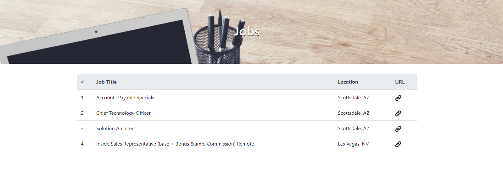

# Web scraping
Johan Alejandro Holguín Arango
### Etapa 2
1. Ingresar a la página [solicitada](https://www.iceenterprise.com/careers/jobs-results/?category=All&location=All).
2. Presionar F12 para abrir la consola del navegador
3. Ejecutar el siguiente script:

        var jobList = document.getElementsByClassName("row job-search-result");
        var  result = [];
        for (i = 0; i < jobList.length; i++) {
          result.push({
            title: jobList[i].querySelector("h3").innerHTML, 
            url: jobList[i].querySelector("a").href, 
            location: jobList[i].querySelector("p").innerHTML
          });
        }
        var jobs = {jobs: result}
        jobs
  ### Etapa 3
Se creó un proyecto de nodeJS, con la función "generateTable" que recibe el arreglo generado anteriormente para mostrarlo en una tabla.



### Instalación
Es necesario tener instalado nodeJS.
```sh
$ cd 
$ npm install
$ npm start
```
